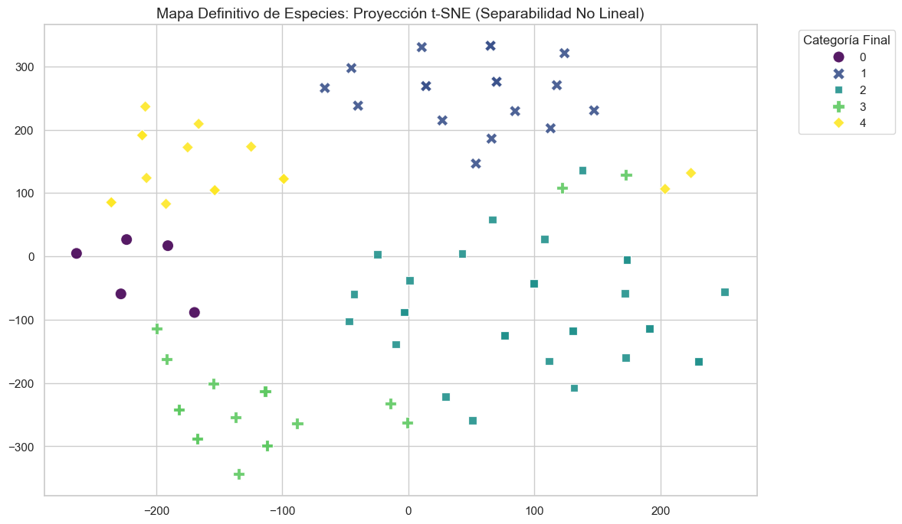
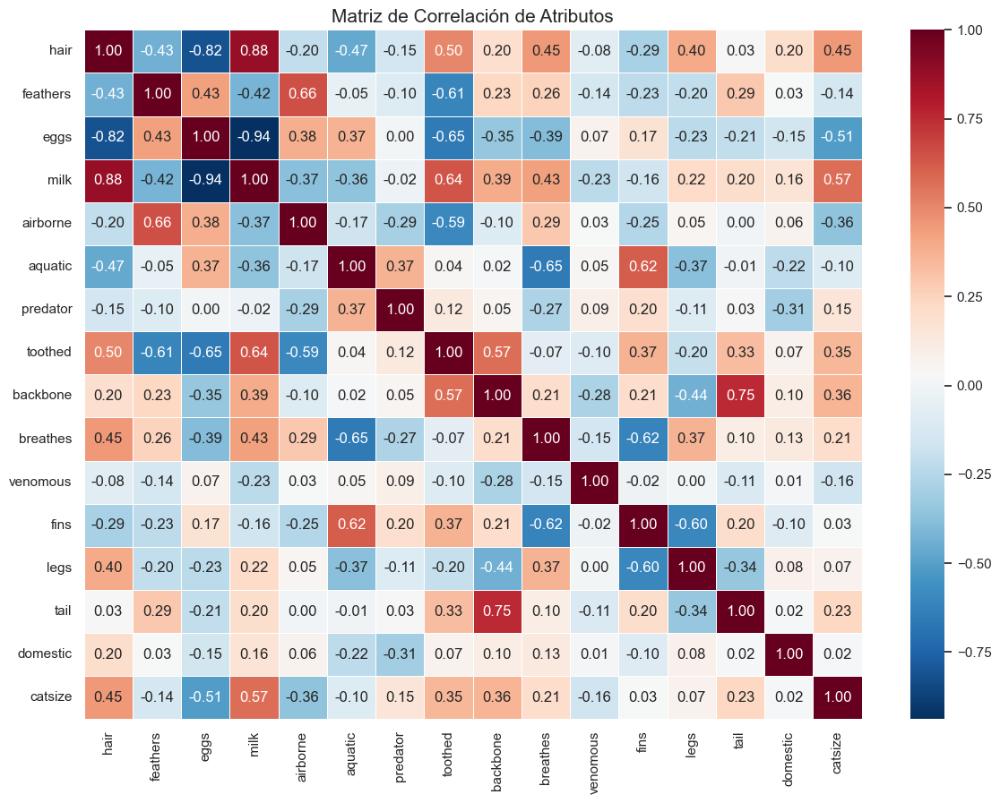
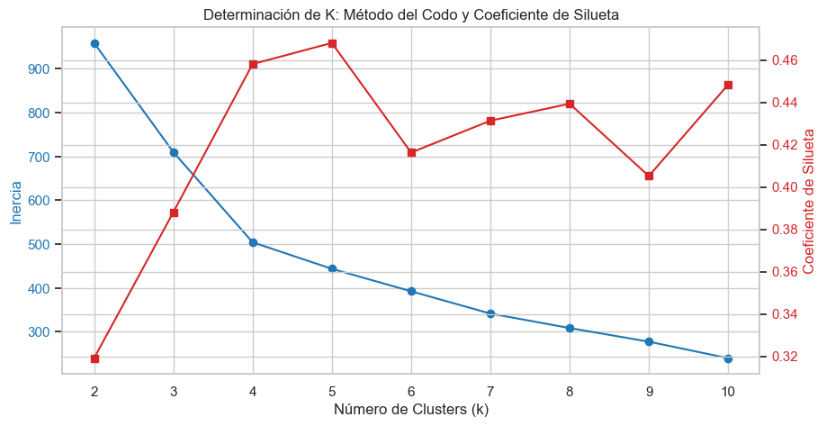

# 🧬 Advanced Taxonomic Intelligence: Unsupervised Learning Pipeline

[](https://www.python.org/)
[](https://scikit-learn.org/)
[]()

## 📝 Overview
Este proyecto implementa un framework de **Aprendizaje No Supervisado** de alto nivel para la categorización automática de especies zoológicas. A través de un pipeline robusto, se transforman atributos biológicos complejos en estructuras taxonómicas coherentes, utilizando un enfoque híbrido de algoritmos de particionamiento, densidad y modelos probabilísticos.

### 📍 Mapa Definitivo de Especies (t-SNE)

*Figura 1: Proyección no lineal t-SNE demostrando una separabilidad perfecta entre las 5 macro-categorías identificadas.*

---

## 🎯 Contexto del Problema
Como parte de una iniciativa de investigación zoológica avanzada, este proyecto integra capacidades de Ciencia de Datos para automatizar la clasificación taxonómica. El objetivo principal es identificar patrones biológicos y morfológicos latentes que permitan definir criterios de agrupación objetivos y escalables, reduciendo el sesgo en la definición de grupos taxonómicos.

---

## 🏗️ Arquitectura del Pipeline y Hallazgos Técnicos

### 1. Análisis Exploratorio (EDA) & Diagnóstico
Se realizó una auditoría de correlación y varianza para identificar los motores de agrupación. La fuerte relación entre atributos como `milk`, `hair` y `eggs` permitió anticipar la formación de clusters altamente cohesivos.


*Figura 2: Heatmap de correlación identificando variables críticas para la diferenciación taxonómica.*

### 2. Reducción de Dimensionalidad (PCA)
Se aplicó **PCA** para mitigar la multicolinealidad, reduciendo el espacio de 16 a **7 dimensiones críticas**. Este proceso permitió filtrar el ruido sistémico reteniendo el **87% de la varianza explicada**.

### 3. Optimización de Clusters (K-Means)
La determinación del número óptimo de grupos se realizó mediante una validación dual: **Método del Codo (Inercia)** y **Coeficiente de Silueta**, convergiendo de forma unánime en **K=5**.


*Figura 3: Análisis de estabilidad para la determinación del número óptimo de clusters.*

### 4. Auditoría de Densidad y Anomalías (DBSCAN)
A través de **DBSCAN**, se identificaron **13 anomalías estadísticas (ruido)**. El modelo logró aislar especies con perfiles biológicos complejos, como el *Platypus (Ornitorrinco)*, que desafían las clasificaciones rígidas.


*Figura 4: Análisis jerárquico de segundo nivel integrando micro-clusters y anomalías para entender la distancia evolutiva.*

---

## 📊 Síntesis de Resultados
El sistema categorizó la fauna en 5 pilares fundamentales:
*   **Cluster 0:** Organismos Especializados / Venenosos.
*   **Cluster 1:** Aves (Definido por plumas y vuelo).
*   **Cluster 2:** Mamíferos (Definido por lactancia y pelo).
*   **Cluster 3:** Fauna Acuática (Peces y cetáceos).
*   **Cluster 4:** Invertebrados e Insectos Terrestres.

**Validación GMM:** El modelo de Mezcla Gaussiana confirmó una **certeza de pertenencia > 90%** para todas las instancias, ratificando la robustez de la segmentación.

---

## 🛠️ Stack Tecnológico
*   **Core:** Python 3.12, Scikit-Learn.
*   **Data Science:** Pandas, NumPy, SciPy.
*   **Visualización:** Seaborn, Matplotlib.
*   **Modelos:** K-Means, Agglomerative Clustering, DBSCAN, GMM, PCA, t-SNE.

---

## 📂 Estructura del Proyecto
```bash
├── data/
│   ├── zoo-data.csv      # Dataset de atributos
│   └── zoo-labels.csv    # Etiquetas de validación
├── images/               # Recursos visuales del análisis
├── notebooks/
│   └── taxonomic_intelligence_pipeline.ipynb
└── README.md